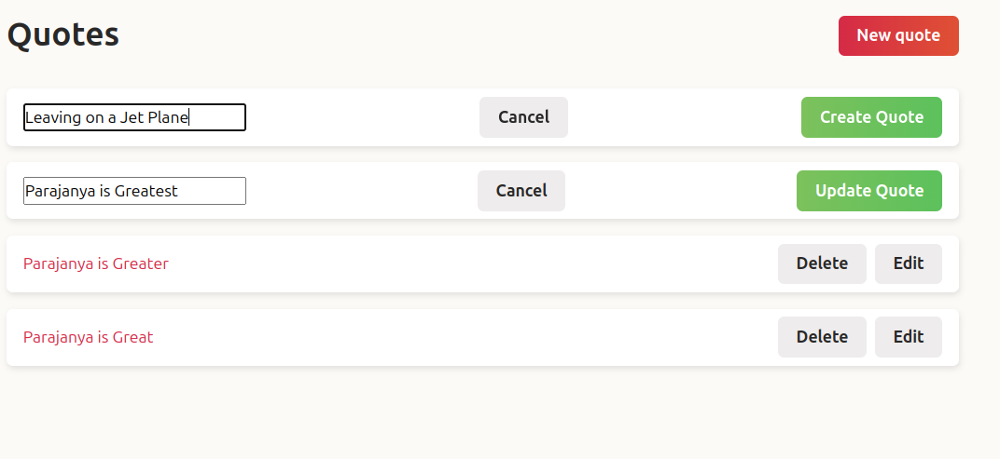

# Turbo Streams in Rails

Welcome to the Turbo Streams tutorial! This guide will help you understand how to use Turbo Streams with Rails to create reactive single-page applications without writing custom JavaScript.

## Table of Contents

1. [Introduction](#introduction)
2. [Setup](#setup)
3. [Turbo Streams Basics](#turbo-streams-basics)
4. [Real-time Updates](#real-time-updates)
5. [Security Considerations](#security-considerations)
6. [Flash Messages with Turbo](#flash-messages-with-turbo)
7. [Handling Empty States](#handling-empty-states)
8. [Further Reading](#further-reading)

## Introduction

Turbo Streams are part of the Hotwire framework, which is included by default in Rails 7. They allow for real-time updates to your application without the need for custom JavaScript, enabling a seamless user experience.

## Setup

To get started with Turbo Streams in your Rails application, ensure you have Rails 7 installed and your application is set up with the necessary Turbo components.

## Turbo Streams Basics

Turbo Streams can be used to update parts of your web page dynamically. This tutorial will cover how to:

- Create Turbo Stream templates
- Use Turbo Frames to slice your page into independent, updateable parts

## Real-time Updates

Learn how to broadcast Turbo Stream templates with Action Cable, allowing for real-time updates on your web pages. This section will demonstrate:

- Setting up Action Cable
- Broadcasting updates to Turbo Stream templates

## Security Considerations

It's important to handle Turbo Streams securely to prevent unauthorized users from receiving broadcasts. This section will discuss best practices for securing Turbo Streams in your application.

## Flash Messages with Turbo

Integrate flash messages into your application using Turbo and add nice animations with Stimulus. This enhances user feedback and overall application interactivity.

## Handling Empty States

Discover two methods for handling empty states in your application:

1. Using Turbo Frames and Turbo Streams
2. Utilizing the `:only-child` CSS pseudo-class

## Further Reading

For a comprehensive understanding of Turbo Streams and other Hotwire components, refer to the full tutorial on [Hotrails.dev](https://www.hotrails.dev/turbo-rails/turbo-streams) and consider exploring additional chapters and examples provided by the tutorial author.

---
